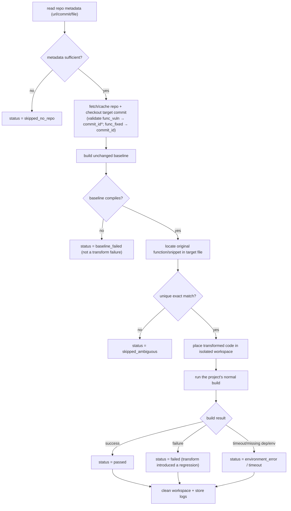

# C/C++ Transformation Framework V3: Repository-Level Validation (Plan Only, No Implementation)

> Constraint compliance: this plan **does not modify any existing code**. lxml remains the default and only rewriting backend.
> Split note: this V3 **covers repository-level compilation validation only**; source-location tracking is in **V2** (`framework_plan_v2_*`).
> Dependency note: V3's "locate the file and code position / reverse line-number mapping" depends on **V2's `SourceLocation` model**; V2 should land first.

---

## 1. Requirement

Beyond the lightweight validation, add **repository-level compilation validation**: when repository context is available, the framework should be able to -
1. obtain/locate the original repository; 2. use the correct revision/commit; 3. locate the original file and code location; 4. place the transformed code back into the repository; 5. run the project's normal build; 6. determine whether the transformed repository still compiles; 7. record the result and logs.
**Conceptually separate from lightweight validation**: every input still undergoes structural checks + srcML reparse (mandatory); repository-level compilation is only available when repository context is sufficient.

## 2. Relationship to the Existing Framework

- The current [pipeline.py](cpp_transform/pipeline.py) runs `srcml_reparse + structural + applied (+ compiler)` after unparse, rolls back on failure, and keeps the batch going; the `CompilerValidator` in [validation/validators.py](cpp_transform/validation/validators.py) already uses an `original vs transformed` dual compile to distinguish "the snippet was never independently compilable (skipped)" from "the transform introduced a regression (failed)" - **this idea is directly reused at the repository level as baseline vs transformed build**.
- **The data already supports it**: each record in `sven_sample_10.jsonl` contains `project_url / commit_id / file_name / func_name / line_changes`, which provide the repository address, revision, target file, and location anchors.
- **`commit_id` semantics (empirically confirmed, critical)**: `commit_id` is the **fix commit**, not the vulnerability-introducing commit. `func_fixed` = the function in the target file at `commit_id` (the fixed version); `func_vuln` = the function at the **parent commit `commit_id^`** (the vulnerable version); `line_changes.added` are lines the fix introduced and appear only in `func_fixed`. Verified: for record 1 (DBD-mysql/`dbdimp.c`/`3619c170`), the fix-added line `imp_sth->stmt->bind[i].buffer_length = fbh->length;` is present in the file at `commit_id` and occurs 0 times at the parent commit `2195ec63`. This reflects the SVEN convention of extracting (vuln@parent, fixed@commit) function pairs from a fix commit.
- **Design stance**: add an independent `repo/` subsystem, triggered via [pipeline.py](cpp_transform/pipeline.py) in the validate stage behind an **optional switch**; [TransformResult](cpp_transform/model/result.py) gains a `repo_validation` field. No existing module is rewritten.

## 3. Repository-Level Validation Workflow

- **Which commit to check out depends on the field being validated (driven by `commit_id` semantics)**: validating `func_vuln` MUST check out **`commit_id^` (parent / vulnerable state)** - only there does the target file naturally contain `func_vuln`, so the exact-text match lands and the baseline is "vulnerable state, unmodified"; validating `func_fixed` checks out `commit_id`. Resolve the parent with `git rev-parse <commit_id>^1` (first parent); merge commits (multiple parents) or root commits (no parent) -> `environment_error`/`skipped`, no guessing. Ignore `?w=1` and similar params in `commit_url`; always rely on the clean `commit_id` field.
- **Isolation and cleanup**: each record operates in an isolated temporary workspace (git worktree or repository copy), restored/removed afterward, never polluting the cached clean checkout.
- **Baseline first**: an unchanged baseline must be built first; if the baseline already fails -> `baseline_failed`, which is how we **distinguish "the repository already fails to build" from "the transformation caused the build to fail."**
- **Avoid patching the wrong location**: locate using `func_name` + signature + exact original text (aided by V2's location/line-number mapping); multiple or fuzzy matches -> `skipped_ambiguous`, with **no guessing and no incorrect patching**.
- **Replacement granularity**: whole-function replacement (replace the original function span with the transformed `func_*` as a whole) first; snippet-level replacement is a later enhancement (needs V2 positions + context anchoring).
- **Failure classification**: timeouts, missing dependencies, missing toolchains, and network failures are all classified as `environment_error/timeout` and **not counted as transformation failures**.

## 4. Required Repository Metadata and Build Configuration

- **Required metadata**: repository address (`project_url` or a local path), revision (`commit_id`), target file (`file_name`), location info (`func_name`/original text).
- **Revision resolution**: `commit_id` is the fix commit; derive the actual checkout revision from the validated field - `func_vuln` -> `commit_id^1` (parent), `func_fixed` -> `commit_id`. The metadata layer is responsible for producing the "revision to check out" rather than using `commit_id` directly.
- **Build-configuration abstraction (no hard-coding for a single repo)**: a pluggable "build recipe" configuration (a separate JSON/registry), each entry containing `setup_cmd`, `build_cmd`, `workdir`, `timeout`, and an optional container image; provide generic detection (autotools `./configure && make`, `cmake`, `make`) as defaults, overridable per `project`.
- The design stays **dataset-agnostic**: it does not assume all records carry the same fields; missing fields downgrade to `skipped_no_repo`.

## 5. Changes to the Existing Architecture and Data Models

- **Add** `cpp_transform/repo/`:
  - `metadata`: parse repository metadata from a record (url/commit/file/func).
  - `provision`: clone/cache/checkout, isolated-workspace lifecycle.
  - `placement`: locate the original function/snippet in the target file and place the transformed code back (reusing V2 positions).
  - `build`: run setup/build per the build recipe, with timeout and output capture.
  - `classify`: map build/environment outcomes to repo_validation statuses.
- **Minor extensions** (no rewrite):
  - [model/result.py](cpp_transform/model/result.py): add a `repo_validation` field.
  - [pipeline.py](cpp_transform/pipeline.py): in the validate stage, invoke repo validation when metadata is sufficient and the switch is enabled; continue "isolate per-record failures, keep the batch going."
  - [io/writer.py](cpp_transform/io/writer.py) / [report/report.py](cpp_transform/report/report.py): extend output and reporting.
  - [cli.py](cpp_transform/cli.py): add a `--repo-validate` switch, build-recipe path, cache directory, etc.

## 6. Output Metadata and Status Enums

- New transform metadata: `repo_validation`: `{status, baseline_status, mapping_status, build_log_ref, matched_span, project, commit}`.
- **repo_validation status**: `passed | failed | baseline_failed | skipped_no_repo | skipped_ambiguous | environment_error | timeout | not_attempted`.
- Stored **alongside** the lightweight validation status (`success | skipped | failed`), neither overwriting the other.
- Logs: `run_log.jsonl` gains repo fields; detailed build output is stored separately with a referenced path (`build_log_ref`); the report gains a "repository-validation outcome distribution" summary.

## 7. Staged Implementation Plan and Dependencies

- **Prerequisite**: V2 source-location tracking (for locating the file and code position, and reverse line-number mapping).
- **Phase 1**: metadata parsing + build-recipe configuration (dataset-agnostic).
- **Phase 2**: provision + checkout + isolated workspace + post-run cleanup.
- **Phase 3**: baseline build + adjudication, distinguishing `baseline_failed` from `failed`.
- **Phase 4**: exact whole-function placement + build adjudication + status classification + logging, proving the minimal loop on a **single repository**.
- **Phase 5 (optional)**: snippet-level precise placement, build-recipe registry, repository caching and parallelism.
- **Phase 6 (deferrable)**: containerized builds (Docker) for better reproducibility.
- **Dependencies**: the baseline build must precede the transformation adjudication; whole-function placement depends on V2 location.

## 8. Risks, Limitations, and Open Questions

- **Risks/limitations**: Windows vs WSL path/execution differences; cloning large repos is slow/disk-heavy/network-dependent; real project build environments are hard to reproduce (may need Docker); function-matching ambiguity; build side effects/nondeterminism.
- **Resolved decisions (open questions confirmed)**:
  1. **Network cloning allowed** into a local cache directory; **no Docker** for Phases 1-4 (Docker deferred to Phase 6).
  2. Default **build timeout 600 seconds**, **no retry**.
  3. **Validate `func_vuln` only** (hence check out `commit_id^`); `func_fixed` not validated for now.
  4. Build recipes **auto-detection first** (autotools/cmake/make), with a hand-written recipe as a fallback for the pilot repository.
  5. Primary runtime is **WSL**.
- **First pilot repository**: `oniguruma` (pure C, self-contained, autotools, fast to build).

## 9. Recommendation on What to Implement First

- Start V3 **after V2 lands**; within V3, **do the single-repository minimal loop of Phases 1-4 first** (whole-function replacement + baseline build), proving it on one easy-to-build repository in the dataset, then generalize to a build-recipe registry and caching/parallelism.
- Throughout, **lxml stays the default and untouched**.
