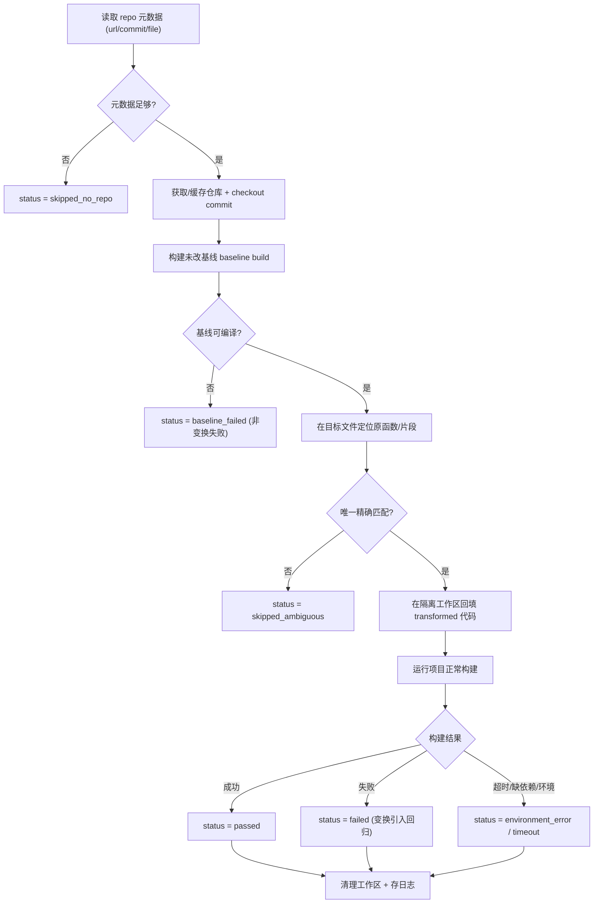

# C/C++ 变换框架 V3:仓库级验证(仅规划,不实现)

> 约束遵守:本方案**不修改任何现有代码**。lxml 仍是默认且唯一的改写后端。
> 拆分说明:本 V3 **只覆盖仓库级编译验证**;源位置追踪见 **V2**(`framework_plan_v2_*`)。
> 依赖说明:V3 的"定位文件与代码位置 / 行号反向映射"依赖 **V2 的 `SourceLocation` 模型**;建议 V2 先行落地。

---

## 1. 需求理解

在轻量验证之外,新增**仓库级编译验证**:当仓库上下文可用时,框架应能——
1. 获取/定位原始仓库;2. 使用正确的修订/commit;3. 定位原始文件与代码位置;4. 将变换后代码回填到仓库;5. 跑项目正常构建;6. 判定变换后仓库是否仍可编译;7. 记录结果与日志。
**与轻量验证概念分离**:对每条输入仍做结构检查 + srcML 重解析(必做);仓库级编译只在仓库上下文充足时可用。

## 2. 与现有框架的关系评估

- 现有 [pipeline.py](cpp_transform/pipeline.py) 在 unparse 后做 `srcml_reparse + structural + applied (+ compiler)` 验证,失败回退原文、整批继续;[validation/validators.py](cpp_transform/validation/validators.py) 的 `CompilerValidator` 已用 `original vs transformed` 双编译来区分"片段本来不可编译(skipped)"与"变换引入回归(failed)"——**这一思路在仓库级直接复用为 baseline vs transformed build**。
- **数据已支撑**:`sven_sample_10.jsonl` 每条含 `project_url / commit_id / file_name / func_name / line_changes`,正好提供仓库地址、修订、目标文件、定位锚点。
- **设计取向**:新增独立 `repo/` 子系统,通过 [pipeline.py](cpp_transform/pipeline.py) 在 validate 段以**可选开关**触发;[TransformResult](cpp_transform/model/result.py) 增 `repo_validation` 字段。不重写现有任何模块。

## 3. 仓库级验证工作流

- **隔离与清理**:每条记录在独立临时工作区(git worktree 或仓库副本)操作,完成后还原/删除,绝不污染缓存的干净 checkout。
- **基线优先**:必须先建未改基线;基线本就失败 → `baseline_failed`,据此**把"仓库本来编译不过"与"变换导致编译失败"区分开**。
- **防打错位置**:用 `func_name` + 签名 + 原文文本精确匹配定位(借助 V2 的位置/行号映射);多匹配或模糊 → `skipped_ambiguous`,**不猜测、不乱 patch**。
- **替换粒度**:整函数替换(用变换后 `func_*` 整体替换原函数 span)优先;snippet 级替换作为后续增强(需 V2 位置 + 上下文锚定)。
- **失败分类**:超时、缺依赖、工具链缺失、网络失败统一归 `environment_error/timeout`,**不计为变换失败**。

## 4. 所需仓库元数据与构建配置

- **必需元数据**:仓库地址(`project_url` 或本地路径)、修订(`commit_id`)、目标文件(`file_name`)、定位信息(`func_name`/原文)。
- **构建配置抽象(不硬编码单仓库)**:可插拔的 "build recipe" 配置(独立 JSON/registry),每项含 `setup_cmd`、`build_cmd`、`workdir`、`timeout`、可选容器镜像;提供通用探测(autotools `./configure && make`、`cmake`、`make`)作默认,允许按 `project` 覆盖。
- 设计保持**数据集无关**:不假设所有记录都含相同字段,缺字段则降级为 `skipped_no_repo`。

## 5. 对现有架构与数据模型的改动

- **新增** `cpp_transform/repo/`:
  - `metadata`:从记录解析仓库元数据(url/commit/file/func)。
  - `provision`:clone/缓存/checkout、隔离工作区生命周期。
  - `placement`:在目标文件中定位原函数/片段并回填变换后代码(复用 V2 位置)。
  - `build`:按 build recipe 跑 setup/build,带超时与输出捕获。
  - `classify`:把构建/环境结果映射为 repo_validation 状态。
- **小幅扩展**(不重写):
  - [model/result.py](cpp_transform/model/result.py):新增 `repo_validation` 字段。
  - [pipeline.py](cpp_transform/pipeline.py):validate 段在元数据充足且开关开启时调用 repo 验证;延续"单条失败隔离、整批继续"。
  - [io/writer.py](cpp_transform/io/writer.py)/[report/report.py](cpp_transform/report/report.py):输出与报告扩展。
  - [cli.py](cpp_transform/cli.py):新增 `--repo-validate` 开关、build recipe 路径、缓存目录等参数。

## 6. 输出元数据与状态枚举

- transform 元数据新增:`repo_validation`: `{status, baseline_status, mapping_status, build_log_ref, matched_span, project, commit}`。
- **repo_validation status**:`passed | failed | baseline_failed | skipped_no_repo | skipped_ambiguous | environment_error | timeout | not_attempted`。
- 与轻量验证 status(`success | skipped | failed`)**并列存储、互不覆盖**。
- 日志:`run_log.jsonl` 增 repo 字段;构建详细输出单独落盘,记录引用路径(`build_log_ref`);report 增"仓库验证结果分布"汇总。

## 7. 分阶段实施计划与依赖

- **前置**:V2 源位置追踪(用于定位文件与代码位置、行号反向映射)。
- **阶段 1**:元数据解析 + build recipe 配置(数据集无关)。
- **阶段 2**:provision + checkout + 隔离工作区 + 用后清理。
- **阶段 3**:baseline build + 判定,区分 `baseline_failed` 与 `failed`。
- **阶段 4**:整函数精确匹配回填 + 构建判定 + 状态分类 + 日志,**单仓库**跑通最小闭环。
- **阶段 5(可选)**:snippet 级精确回填、build recipe registry、仓库缓存与并行。
- **阶段 6(可延后)**:构建容器化(Docker)以提升可复现性。
- **依赖**:baseline build 必须先于变换判定;整函数回填依赖 V2 定位。

## 8. 风险、限制与未决问题

- **风险/限制**:Windows 与 WSL 路径/执行差异;clone 大仓库耗时/占盘/依赖网络;真实项目构建环境难复现(可能需 Docker);函数匹配歧义;构建副作用/不确定性。
- **需你拍板的开放问题**:
  1. 仓库级验证是否允许**联网 clone**?是否使用 **Docker**?缓存目录放哪?
  2. 默认**构建超时**阈值与失败重试策略?
  3. 是否对 `func_fixed` 也做仓库验证,还是只验 `func_vuln`?
  4. build recipe 由数据集附带、人工维护,还是自动探测优先?
  5. 运行主战场是 **WSL** 还是原生 Windows?

## 9. 关于"先做什么"的建议

- 等 **V2 落地后**再开 V3;V3 内部**先做阶段 1~4 的单仓库最小闭环**(整函数替换 + baseline build),在数据集中挑 1 个易构建仓库验证,再推广到 build recipe registry 与缓存/并行。
- 全程 **lxml 保持默认且不动**。
