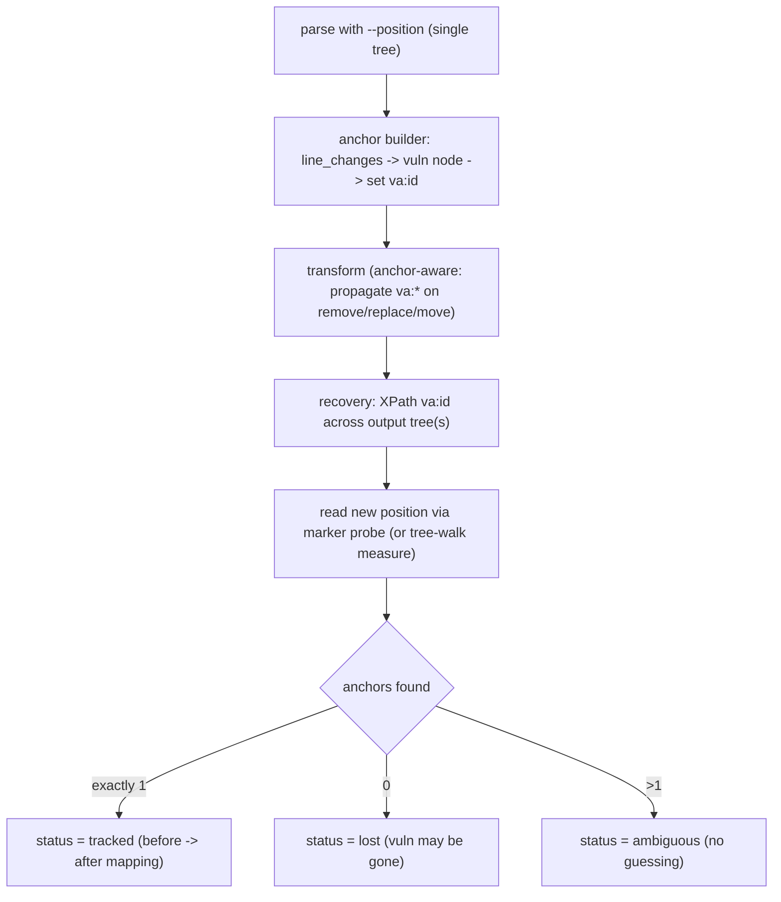

# C/C++ Transformation Framework V4: In-Tree Vulnerability Anchor Attribute (Phases 1-5 Implemented)

> Implementation status (2026-06): phases 1-5 are implemented and the full suite passes (102 passed). Added `cpp_transform/anchor/` (attr/builder/recover/classify/finalize); a propagation contract + `carry_anchor` in `transforms/base.py` applied to `variable_chain`; an `anchors=` hook in `pipeline.py`; a `--track-anchor` switch on the batch CLI; a `vuln_anchor` block on `model/result.py`; anchor-outcome counts in `report.py`. Proven end-to-end on FFmpeg record 9 (anchor lands on the real vulnerable statement, survives the transform as `tracked`, before->after mapping produced). Phase 6 (cross-file / multi-anchor) remains deferred.

> Constraint: lxml remains the only rewriting backend. We do **not** fork or recompile the srcML binary - the anchor attribute is added by us in the Python/lxml layer; srcML only needs to tolerate it on unparse (already proven by `pos:*`).
> Split note: V2 = source-location tracking; V3 = repository-level compilation validation; **V4 = vulnerability anchoring** (tracking the vulnerable point through transformation).
> Dependency note: V4 depends on **V2's `SourceLocation`/position reading** and **V3's repo-coordinate lifting of `line_changes`**.

---

## 1. Requirement

Mentor's ask: give each vulnerable point a stable identity that survives transformation. The detector pipeline is: run an LLM/CodeQL detector on the original repo (ground-truth vuln location known) -> transform (which may add lines or even move the vulnerable point to another file) -> re-run the detector on the transformed code. Re-detection only makes sense if we still know **where** the vulnerability went. So we need an anchor that we can search for after transformation.

Mechanism: after srcML parsing, **we** add a custom namespaced attribute (e.g. `va:id="VA1"`) to the vulnerable statement node - analogous to srcML's `pos:start`/`pos:end`, but authored in our lxml layer. After transforming, XPath-search that attribute: found = vulnerability still present, and recover its new `(file, line range)`; not found = `lost` (red flag).

**Conceptual distinction (carried over from earlier discussion):** the framework's existing locators find *transformation candidates* (fixed-pattern nodes that are safe to rewrite); the *vulnerability anchor* is a different thing - the actual vulnerable point from ground truth. They may or may not coincide. V4 introduces anchors as first-class, separate from candidates.

## 2. Why this fits the current pipeline (near-proven)

- `parse` ([cpp_transform/frontends/srcml_frontend.py](cpp_transform/frontends/srcml_frontend.py)) produces a **single tree** carrying srcML `pos:*` attributes; we mutate that tree and `unparse` it via `etree.tostring(unit)` piped back to `srcml`:

```102:105:cpp_transform/frontends/srcml_frontend.py
    def unparse(self, unit: etree._Element) -> str:
        xml_bytes = etree.tostring(unit, encoding="UTF-8", xml_declaration=True)
        out = self._run(["-"], xml_bytes)
        return out.decode("utf-8")
```

- We **already** unparse trees that carry namespaced `pos:*` attributes without problems (README: single tree; position attributes do not affect unparse). So srcML tolerating an extra namespaced `va:*` attribute is the same mechanism - high confidence, with one quick confirmation test. Attributes never appear in C/C++ text, so the anchor cannot pollute code or affect a detector.

## 3. What the attribute does vs. does not

- **DOES** = identity + survival: XPath for `va:id` after transform tells us the vuln node is still there.
- **DOES NOT** = give a line number by itself. srcML `pos:*` go **stale after mutation** (see [cpp_transform/location/model.py](cpp_transform/location/model.py) docstring: "after the lxml tree is mutated those attributes go stale"). So the "after" position is a separate recovery step.

## 4. Workflow



## 5. Position recovery (the one real wrinkle)

The attribute is the durable identity; reading its post-transform line needs one of:

- **Marker probe (recommended)**: keep `va:id` clean through the transform; only just before the final unparse, inject a unique temporary token at the anchored node, unparse, find the token's line in the output, then strip the token. Robust because it reads the real srcML output.
- **Tree-walk measure (fallback)**: walk in document order accumulating `text_of`; the newline count before the `va:id` node = its start line. No token, but our concatenation must match srcml's unparse exactly.

## 6. Anchor-aware transforms (propagation rule)

Core rule: any transform that **removes/replaces/moves** a node must carry `va:*` onto the resulting node(s). In lxml this is one line (`new.set(attr, old.get(attr))`); a plain move carries it automatically since the attribute lives on the element.

- **Concrete case**: `variable_chain` removes the declaration node at `parent.remove(decl_stmt)` ([cpp_transform/transforms/variable_chain.py](cpp_transform/transforms/variable_chain.py) line 177). If the anchor sits on it, we must copy `va:*` onto the new `decl_stmt` that still declares the original variable, before removal.
- Generalize via a small helper + a contract note in [cpp_transform/transforms/base.py](cpp_transform/transforms/base.py) so future transforms follow the same rule.

## 7. Cross-file moves

Because the anchor is an attribute on the element, a node relocated into another file's tree carries it automatically; recovery scans every output file's tree for `va:id` and reports the new file + lines. Only "regenerate-equivalent-code" transforms (those that build fresh nodes from a parsed snippet) must actively re-emit `va:*` onto the grafted node - the same propagation rule, applied at graft time.

## 8. Architecture and data-model changes (additive, no rewrite)

- **Add** `cpp_transform/anchor/`:
  - `attr`: define `VA_NS` + helpers `set_anchor / get_anchor / find_anchors / copy_anchor` (mirrors `POS_NS` usage in [cpp_transform/common.py](cpp_transform/common.py)).
  - `builder`: map SVEN `line_changes` (V3 repo coords) to the smallest enclosing statement node and set `va:id` (+ store the original location).
  - `recover`: XPath anchors post-transform and resolve the new position via the marker probe.
  - `classify`: map anchor counts to `tracked | lost | ambiguous`.
- **Minor extensions** (no rewrite):
  - [cpp_transform/model/result.py](cpp_transform/model/result.py): add a `vuln_anchor` block (id, before location, after location, status).
  - [cpp_transform/transforms/base.py](cpp_transform/transforms/base.py): document the propagation contract + helper; apply it to [cpp_transform/transforms/variable_chain.py](cpp_transform/transforms/variable_chain.py).
  - [cpp_transform/pipeline.py](cpp_transform/pipeline.py): inject before transform, recover after, behind an optional `--track-anchor` switch.
  - [cpp_transform/report/report.py](cpp_transform/report/report.py): anchor-outcome distribution.

## 9. Output metadata and status enums

- New `vuln_anchor`: `{id, role, before: SourceLocation, after: SourceLocation|null, status}`.
- **vuln_anchor status**: `tracked | lost | ambiguous | not_attempted`.
- Stored **alongside** `validation` (snippet-level) and `repo_validation` (whole-repo), never overwriting them.

## 10. Staged implementation plan and dependencies

- **Prerequisite**: V2 (position reading) and V3 (repo-coordinate lifting of `line_changes`).
- **Phase 1**: `VA_NS` + attribute helpers + unparse-tolerance feasibility test (10-min confirm).
- **Phase 2**: anchor builder (`line_changes` -> node -> `va:id`).
- **Phase 3**: anchor-aware propagation contract + `variable_chain`.
- **Phase 4**: recovery (marker probe) + status classification + result/report wiring.
- **Phase 5**: prove end-to-end on FFmpeg record 9 (the V3 pilot), showing a before -> after anchor mapping under a real `variable_chain` edit.
- **Phase 6 (optional/deferred)**: cross-file move support + multi-anchor records.

## 11. Risks, limitations, and open questions

- **Risks/limitations**: `pos:*` staleness forces a separate position-recovery step; transforms that regenerate code must remember to re-emit the anchor; sub-expression-level vulnerabilities only get node/statement granularity; cross-file tracking is genuinely the hard case.
- **Open questions to confirm before coding**:
  1. Attribute granularity = node/statement level (matches line/position-level detection); sub-expression anchoring deferred. OK?
  2. When one anchor is legitimately split into several pieces by a transform: duplicate `va:*` to all pieces, or keep only the primary sink piece?
  3. Recovery mechanism: marker probe (recommended) vs tree-walk measure - default to probe?

## 12. Recommendation on what to implement first

- Do Phases 1-4 first (helpers + builder + propagation + recovery), prove on **one record** (FFmpeg 9) end-to-end, then generalize to cross-file and multi-anchor.
- Throughout, **lxml stays the default and untouched, and the srcML binary is not forked.**
