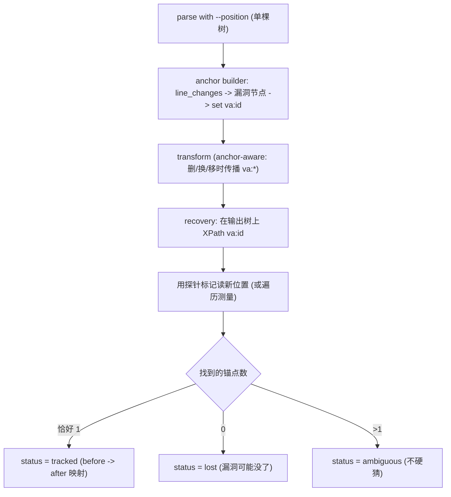

# C/C++ 变换框架 V4:树内漏洞锚点属性(阶段 1~5 已实现)

> 实施状态(2026-06):阶段 1~5 已落地并全部测试通过(102 passed)。新增 `cpp_transform/anchor/`(attr/builder/recover/classify/finalize);`transforms/base.py` 加传播契约 + `carry_anchor` 并应用到 `variable_chain`;`pipeline.py` 加 `anchors=` 钩子;`cli.py` batch 加 `--track-anchor`;`model/result.py` 加 `vuln_anchor` 块;`report.py` 加锚点分布。已在 FFmpeg 记录 9 端到端跑通(锚点落在真实漏洞语句、变换后 `tracked`、产出 before→after 映射)。阶段 6(跨文件/多锚点)仍延后。

> 约束:lxml 仍是唯一改写后端。**不 fork、不重新编译 srcML 二进制**——锚点属性由我们在 Python/lxml 层添加;srcML 只需在 unparse 时容忍它(已被 `pos:`* 证明)。
> 拆分说明:V2 = 源位置追踪;V3 = 仓库级编译验证;**V4 = 漏洞锚定**(在变换全程追踪漏洞点)。
> 依赖说明:V4 依赖 **V2 的 `SourceLocation`/位置读取** 与 **V3 的 `line_changes` repo 坐标提升**。

---

## 1. 需求理解

老师的诉求:给每个漏洞点一个能在变换后存活的稳定身份。检测流程是:在原始 repo 上跑 LLM/CodeQL detector(漏洞真值位置已知)→ 变换(可能加行,甚至把漏洞点移到别的文件)→ 在变换后代码上再跑 detector。再检测要有意义,前提是我们**仍然知道漏洞去哪了**。所以需要一个变换后还能搜到的锚点。

机制:srcML 解析后,**由我们**给漏洞语句节点挂一个自定义命名空间属性(如 `va:id="VA1"`)——和 srcML 的 `pos:start`/`pos:end` 同类,但写在我们的 lxml 层。变换后 XPath 搜这个属性:搜到=漏洞仍在,并回收其新 `(文件, 行区间)`;搜不到=`lost`(红旗)。

**概念区分(承接之前讨论)**:框架现有 locator 找的是*变换候选点*(可安全改写的固定 pattern 节点);*漏洞锚点*是另一回事——来自真值的真实漏洞点。两者不一定重合。V4 把锚点作为一等公民,独立于候选点。

## 2. 为什么天然适配现有流水线(几乎已证明)

- `parse`([cpp_transform/frontends/srcml_frontend.py](cpp_transform/frontends/srcml_frontend.py))产出带 srcML `pos:*` 属性的**单棵树**;我们在该树上变换,再用 `etree.tostring(unit)` 喂回 `srcml` 做 `unparse`:

```102:105:cpp_transform/frontends/srcml_frontend.py
    def unparse(self, unit: etree._Element) -> str:
        xml_bytes = etree.tostring(unit, encoding="UTF-8", xml_declaration=True)
        out = self._run(["-"], xml_bytes)
        return out.decode("utf-8")
```

- 我们**现在就是**带着命名空间属性 `pos:`* 在整棵树上变换并 unparse、毫无问题(README:单树;position 属性不影响 unparse)。所以 srcML 容忍多一个命名空间属性 `va:*` 是同一机制——把握很高,再花 10 分钟确认一次即可。属性永不进 C/C++ 文本,故锚点不污染代码、不影响 detector。

## 3. 它解决什么、不解决什么

- **解决** = 身份 + 存活:变换后 XPath 找 `va:id` 即知漏洞节点是否还在。
- **不解决** = 它本身不给行号。srcML `pos:`* **在树被改后过期(stale)**(见 [cpp_transform/location/model.py](cpp_transform/location/model.py) 注释:"after the lxml tree is mutated those attributes go stale")。所以"变换后位置"是另一个回收步骤。

## 4. 工作流




## 5. 位置回收(唯一真正的难点)

属性负责持久身份;读它变换后的行号,二选一:

- **探针标记(推荐)**:全程用干净的 `va:id` 当锚;**仅在最后 unparse 之前那一刻**,在带锚节点处塞一个唯一临时标记 → unparse → 在输出文本里找到标记所在行 → 删掉标记。稳,因为读的是 srcml 的真实输出。
- **遍历测量(兜底)**:按文档顺序累加 `text_of`,数到带 `va:id` 节点时前面累计的换行数=起始行。不塞标记,但我们的拼接必须和 srcml 的 unparse 完全一致。

## 6. anchor-aware 变换(传播规则)

核心规则:任何会**删/替换/移动**节点的变换,必须把 `va:`* 带到结果节点上。lxml 里这是一行(`new.set(attr, old.get(attr))`);纯移动会自动带走(属性在元素上)。

- **具体例子**:`variable_chain` 在 `parent.remove(decl_stmt)`([cpp_transform/transforms/variable_chain.py](cpp_transform/transforms/variable_chain.py) 第 177 行)删掉声明节点。若锚在它上面,必须在删除前把 `va:`* 复制到仍声明原变量的新 `decl_stmt` 上。
- 在 [cpp_transform/transforms/base.py](cpp_transform/transforms/base.py) 加一个小辅助函数 + 契约说明,使未来变换都遵循同一规则。

## 7. 跨文件移

因为锚是元素上的属性,节点被搬进别的文件的树时会自动带走;回收时**逐个文件扫树找 `va:id`**,报告新文件+行号。只有"重新生成等价代码"的变换(从解析片段构造全新节点)才需要在 graft 时**主动把 `va:`* 重新挂到新节点上**——同一传播规则,作用在 graft 时刻。

## 8. 对现有架构与数据模型的改动(增量,不重写)

- **新增** `cpp_transform/anchor/`:
  - `attr`:定义 `VA_NS` 与 `set_anchor / get_anchor / find_anchors / copy_anchor`(对照 [cpp_transform/common.py](cpp_transform/common.py) 里 `POS_NS` 的用法)。
  - `builder`:把 SVEN `line_changes`(V3 repo 坐标)对到最小包裹语句节点并 set `va:id`(+ 存原始位置)。
  - `recover`:变换后 XPath 锚点,用探针标记解析新位置。
  - `classify`:把锚点数量映射为 `tracked | lost | ambiguous`。
- **小幅扩展**(不重写):
  - [cpp_transform/model/result.py](cpp_transform/model/result.py):新增 `vuln_anchor` 块(id、before 位置、after 位置、status)。
  - [cpp_transform/transforms/base.py](cpp_transform/transforms/base.py):写传播契约+辅助函数;应用到 [cpp_transform/transforms/variable_chain.py](cpp_transform/transforms/variable_chain.py)。
  - [cpp_transform/pipeline.py](cpp_transform/pipeline.py):变换前注入、变换后回收,以可选开关 `--track-anchor` 触发。
  - [cpp_transform/report/report.py](cpp_transform/report/report.py):锚点结果分布。

## 9. 输出元数据与状态枚举

- 新增 `vuln_anchor`:`{id, role, before: SourceLocation, after: SourceLocation|null, status}`。
- **vuln_anchor status**:`tracked | lost | ambiguous | not_attempted`。
- 与 `validation`(片段级)、`repo_validation`(整库级)**并列存储,互不覆盖**。

## 10. 分阶段实施计划与依赖

- **前置**:V2(位置读取)与 V3(`line_changes` 的 repo 坐标提升)。
- **阶段 1**:`VA_NS` + 属性辅助函数 + unparse 容忍性可行性测试(10 分钟确认)。
- **阶段 2**:anchor builder(`line_changes` -> 节点 -> `va:id`)。
- **阶段 3**:anchor-aware 传播契约 + `variable_chain`。
- **阶段 4**:回收(探针标记)+ 状态分类 + result/report 接线。
- **阶段 5**:在 FFmpeg 记录 9(V3 试点)上端到端跑通,展示真实 `variable_chain` 变换下的 before -> after 锚点映射。
- **阶段 6(可选/延后)**:跨文件移动支持 + 多锚点记录。

## 11. 风险、限制与未决问题

- **风险/限制**:`pos:`* 过期迫使另设位置回收步骤;重新生成代码的变换必须记得重挂锚点;子表达式级漏洞只能拿到节点/语句级粒度;跨文件追踪是真正的难点。
- **写代码前要确认的开放问题**:
  1. 属性粒度 = 节点/语句级(对得上行级/位置级检测);子表达式级锚定延后。OK?
  2. 一个锚被变换合法拆成多块时:把 `va:*` 复制到所有碎片,还是只钉在主 sink 那块?
  3. 回收机制:探针标记(推荐)vs 遍历测量——默认探针?

## 12. 关于"先做什么"的建议

- 先做阶段 1~4(辅助函数 + builder + 传播 + 回收),在**单条记录**(FFmpeg 9)上端到端跑通,再推广到跨文件与多锚点。
- 全程 **lxml 保持默认且不动,srcML 二进制不 fork。**

